# PROJECT IoT SEDERHANA SAKLAR LAMPU

## DOWNLOAD BAHAN

Copy link github

```bash
https://github.com/ruspian/project-lampu.git
```

Download aplikasi Arduino IDE
_[Arduino IDE Download](https://www.arduino.cc/en/software/)_

## INSTALL BAHAN

1. Install Arduino IDE
2. Install driver CH34x_Install_Windows_v3_4.exe

### FLASH NODEMCU

1. Koneksikan NodeMCU ke PC menggunakan USB
2. Buka Device Manager di PC dan lihat bagian <b>ports (COM & LPT)</b> jika sudah ada <b>USB-SERIAL CH340 (COMxxx)</b> tandanya driver sudah terinstall dengan baik

## FLASH NODEMCU

1. Buka Folder nodemcu-flasher-master
   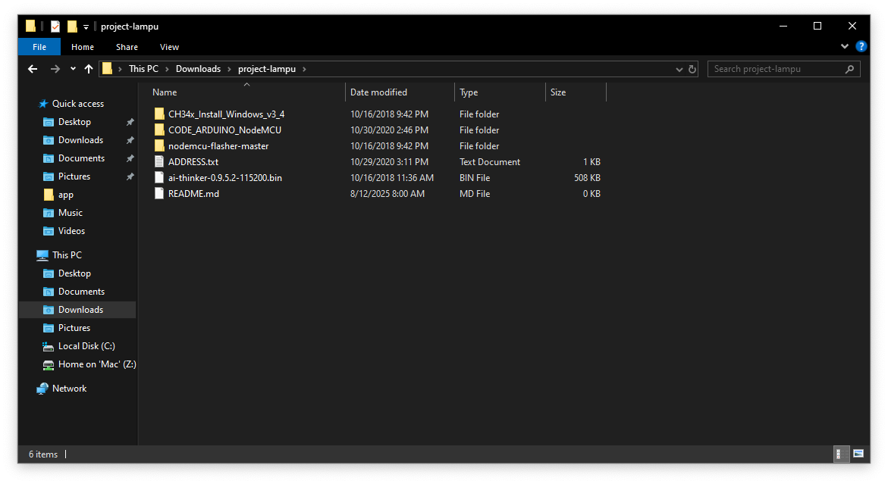
2. Pilih folder sesuai spesifikasi PC (64bit atau 32bit)
   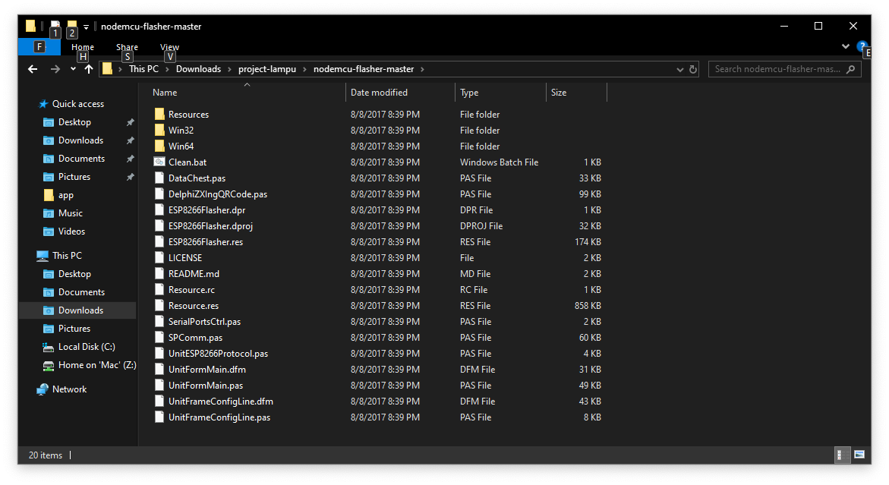
3. Masuk ke folder release
4. Klik ESP8266Flasher.exe
   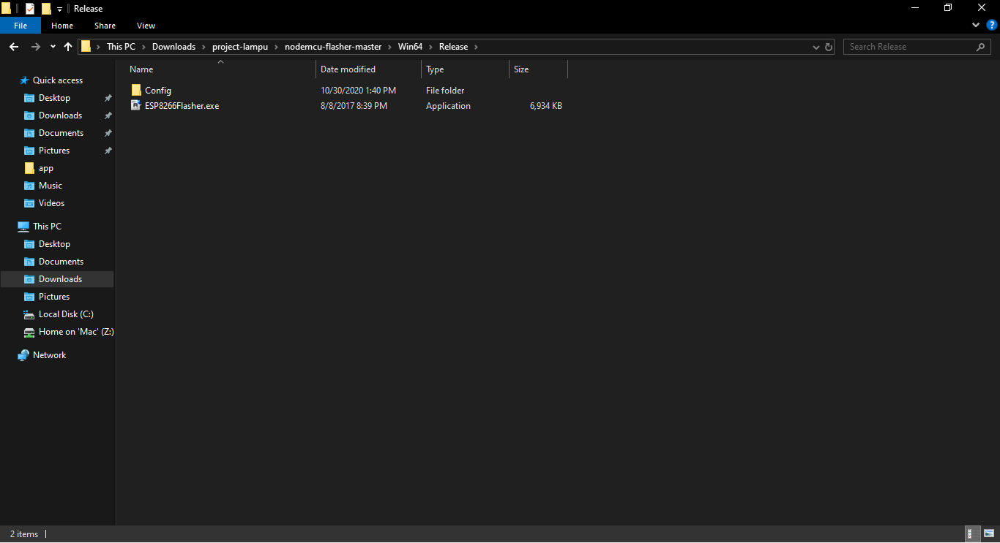
5. Setelah Program ESP8266Flasher.exe terbuka, pilih port COM sesuai dengan port yang terlihat di Device Manager
   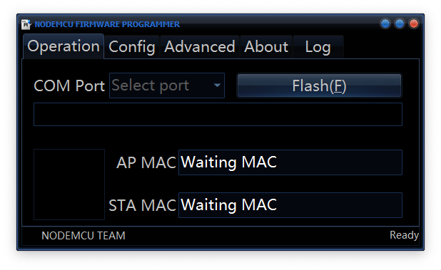
6. Kemudian masuk ke tab <b>CONFIG</b> dan klik icon gir pada INTERNAL://NODEMCU untuk memulih file flash
   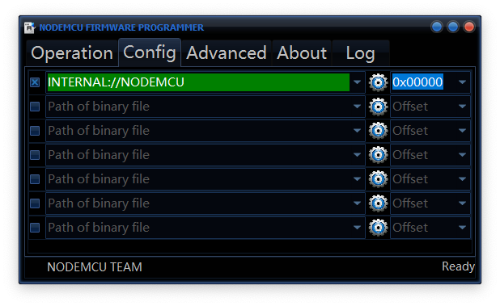
   Kemudian pilih ai-thinker-0.9.5.2-115200.bin
   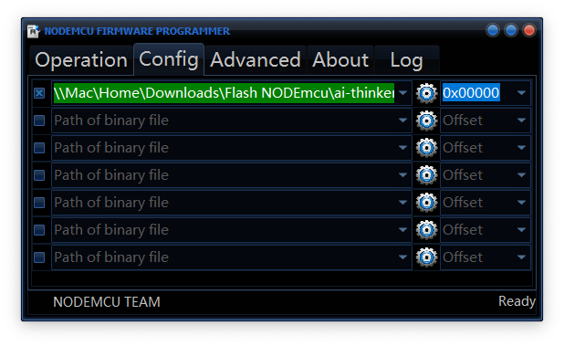
7. Selanjutnya kembali ke tab Operation dan klik <b>Flash</b> dan tunggu hingga selesai

## INSTALL KODE PROGRAM KE NODEMCU

1. Buka Arduino IDE
2. Klik File -> Preferences
   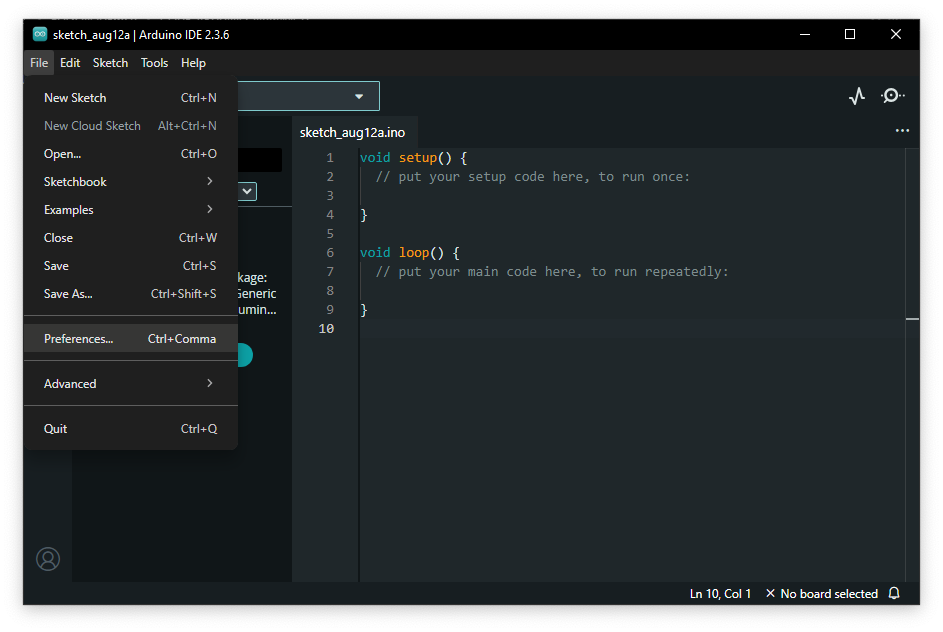
   lalu masukkan link ini di additional board manager url lalu klik ok

```bash
http://arduino.esp8266.com/stable/package_esp8266com_index.json
```

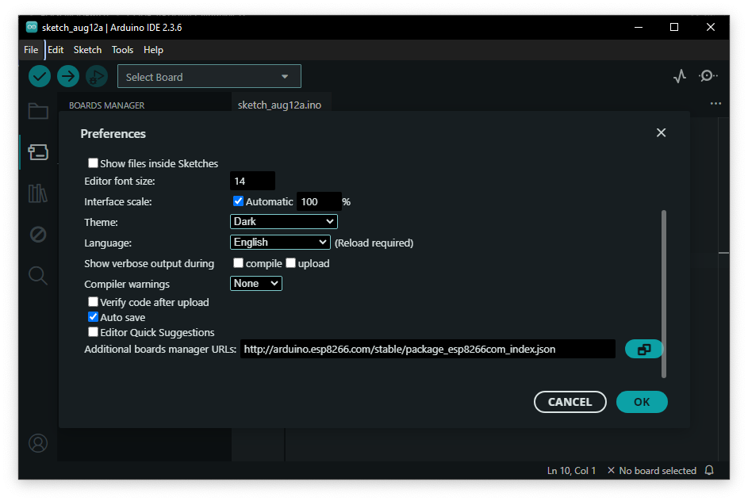 
3. Selanjutnya klik tab Tools -> Board -> Board Manager

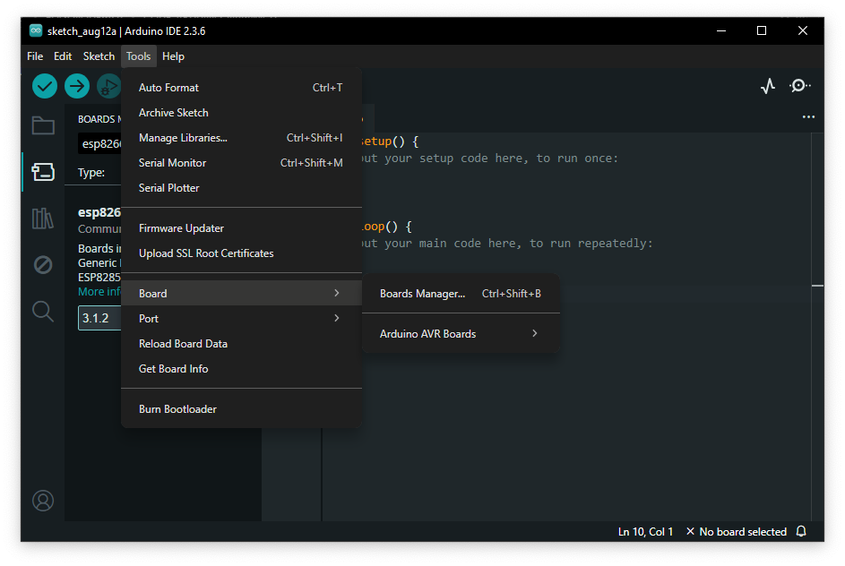

lalu cari <b>esp8266</b> akan muncul <b>esp8266 by ESP8266 Community</b> lalu klik install dan tunggu sampai selesai
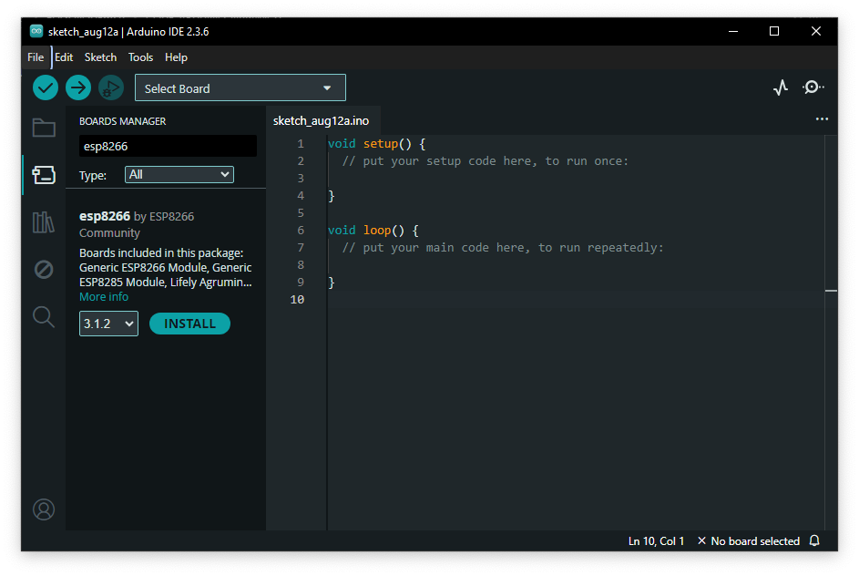 
4. Selanjutnya pada tampilan awal Arduino IDE Klik <b>Select Board</b> kemudian pilih Port sesuai dengan port yang terlihat di Device Manager

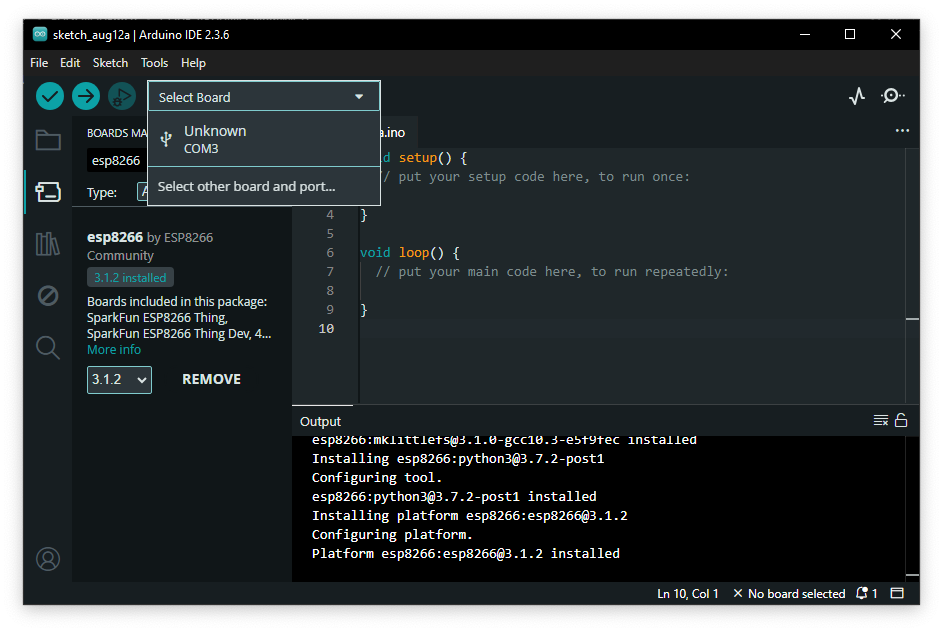

setelah itu cari NodeMCU dan pilih <b>NodeMCU 1.0 (ESP-12E Module)</b> lalu klik ok

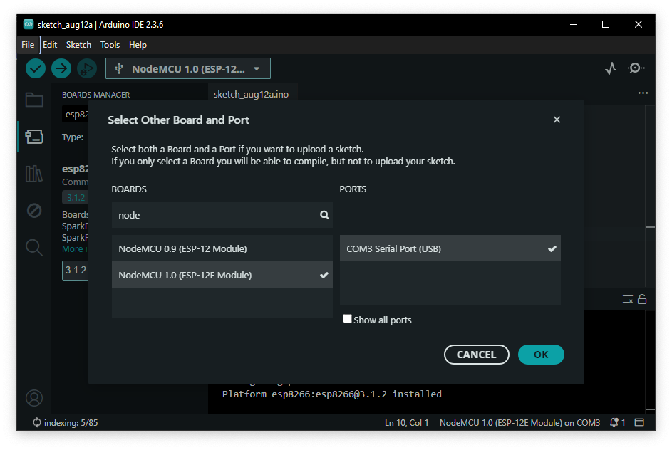 

5. pastekan Kode ini ke Arduino IDE

```cpp
#include <ESP8266WiFi.h>

// ssid esp8266
const char* ssid = "Saklar_Lampu"; // Nama WiFi yang dibuat ESP
const char* password = "12345678"; // Password WiFi minimal 8 karakter

const int relayPin = D1; // Pin relay

// port server
WiFiServer server(80);

void setup() {
  pinMode(relayPin, OUTPUT);
  digitalWrite(relayPin, LOW);

  Serial.begin(115200);

  // Buat Access Point
  WiFi.softAP(ssid, password);

  Serial.println("Access Point dibuat!");
  Serial.print("Nama WiFi: ");
  Serial.println(ssid);
  Serial.print("Password: ");
  Serial.println(password);

  Serial.println("Buka browser dan akses: http://192.168.4.1");

  server.begin();
}

void loop() {
  WiFiClient client = server.available();
  if (!client) return;

  String request = client.readStringUntil('\r');
  client.flush();

  if (request.indexOf("/ON") != -1) {
    digitalWrite(relayPin, HIGH);
  } else if (request.indexOf("/OFF") != -1) {
    digitalWrite(relayPin, LOW);
  }

  // HTML tampilan
  String html = "<!DOCTYPE html><html><head><meta name='viewport' content='width=device-width, initial-scale=1'>";
  html += "<title>Saklar Lampu</title></head><body style='text-align:center;'>";
  html += "<h1>Saklar Lampu</h1>";
  html += "<p><a href='/ON'><button style='width:100px;height:50px;font-size:20px;'>ON</button></a></p>";
  html += "<p><a href='/OFF'><button style='width:100px;height:50px;font-size:20px;'>OFF</button></a></p>";
  html += "</body></html>";

  client.print("HTTP/1.1 200 OK\r\nContent-Type: text/html\r\n\r\n");
  client.print(html);
  delay(1);
}


```

6. selanjutnya tekan tombol arah panah ke kanan untuk upload dan tunggu hingga selesai, setelah upload selesai

## RANGKAI ESP8266 DENGAN RELAY

Rangkai Esp8266 dengan Relay seperti gambar dibawah ini
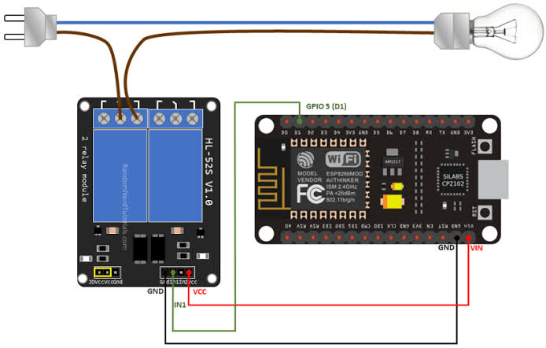

Keterangan:

```bash
# sambungkan relay dan vcc menggunakan kabel jumper

VCC Relay => VIN ESP # jika relay 5volt
VCC Relay => 3V ESP # jika relay 3volt

GND Relay => GND ESP

IN1 Relay => D1 ESP

```
